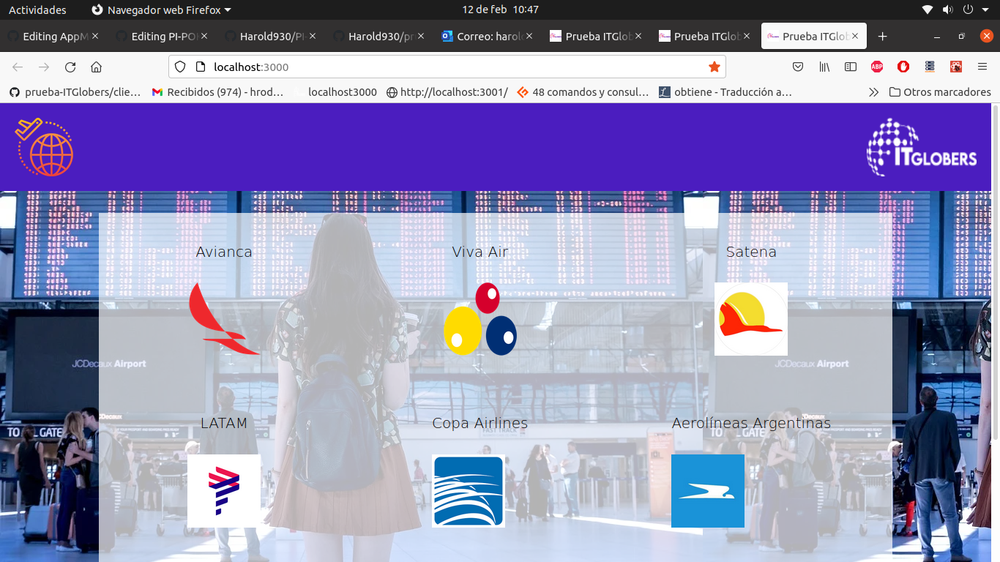
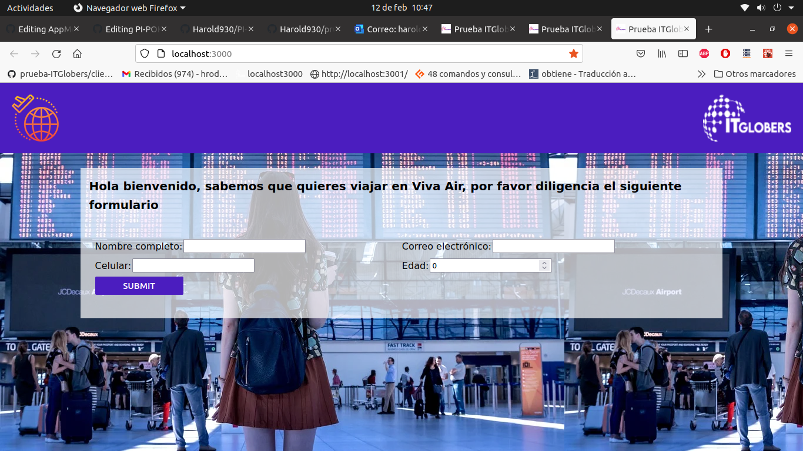
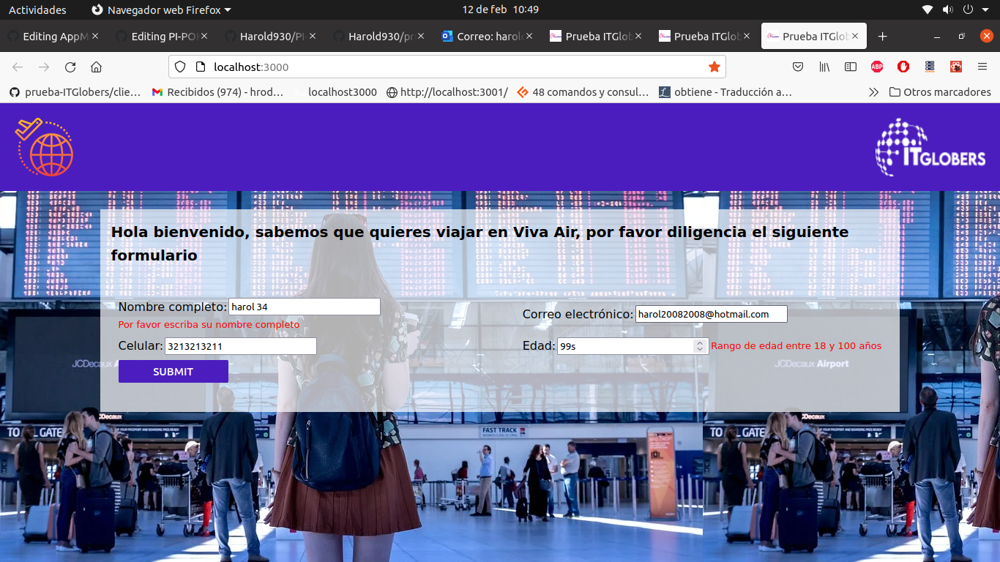
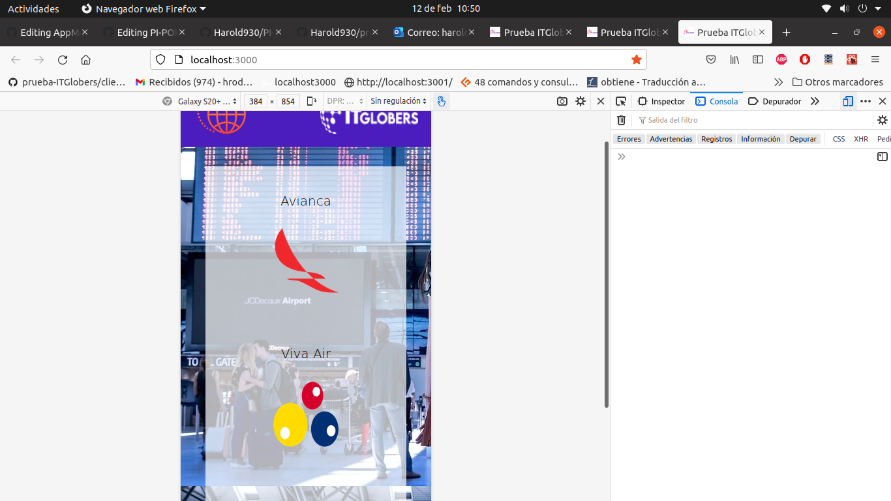
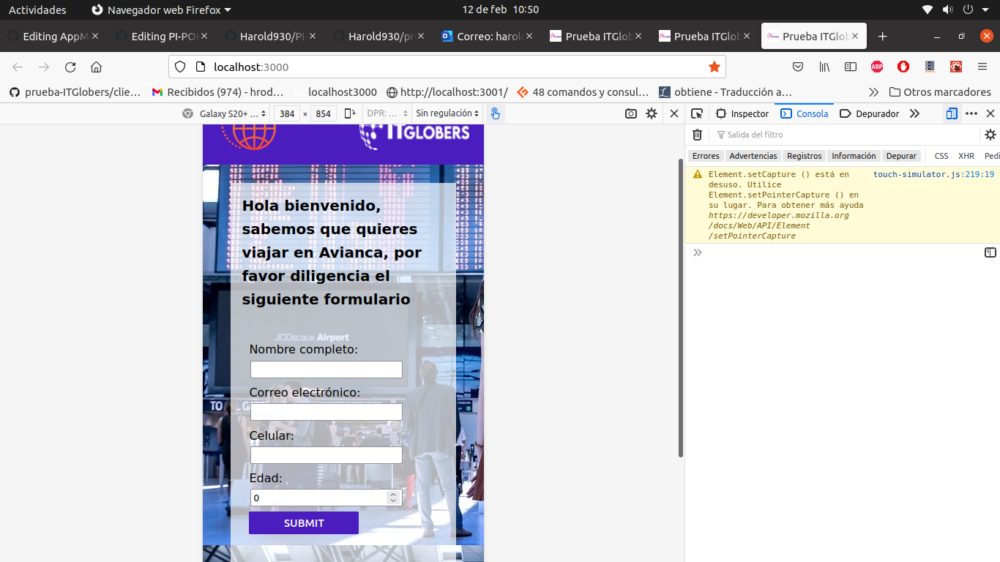

# prueba-ITGlobers

## Instrucciones para ejecutar la página web

Como primera instancia hay que clonar el repositorio.

Luego, el equipo debe tener instalado Node.js, si no está instalado, se puede hacer accediendo al siguiente link y seguir los pasos. [Node.js/Download](https://nodejs.org/es/download/).

Lo que nos queda hacer es pararnos desde la terminal en el directorio client y ejecutar los siguientes comandos:

```
npm install
--Esperar a que se instalen las dependencias--
npm start (para levantar el localhost)
```

Y ya con eso podemos ejecutar la SPA en nuestro equipo. 

En caso de no abrir automaticamente el localhost -->> http://localhost:3000/

### Galeria

Adjunto pantallazos de cómo quedó la página, mostrando la versión de escritorio y la de móvil; tanto 
el menú como el formulario son responsive. También se hacen las validaciones necesarias en el formulario.

 MENÚ

 FORMULARIO

 FORMULARIO MOSTRANDO ALGUNAS VALIDACIONES

 MENÚ RESPONSIVE

 FORMULARIO RESPONSIVE



Gracias por revisar mi prueba. 